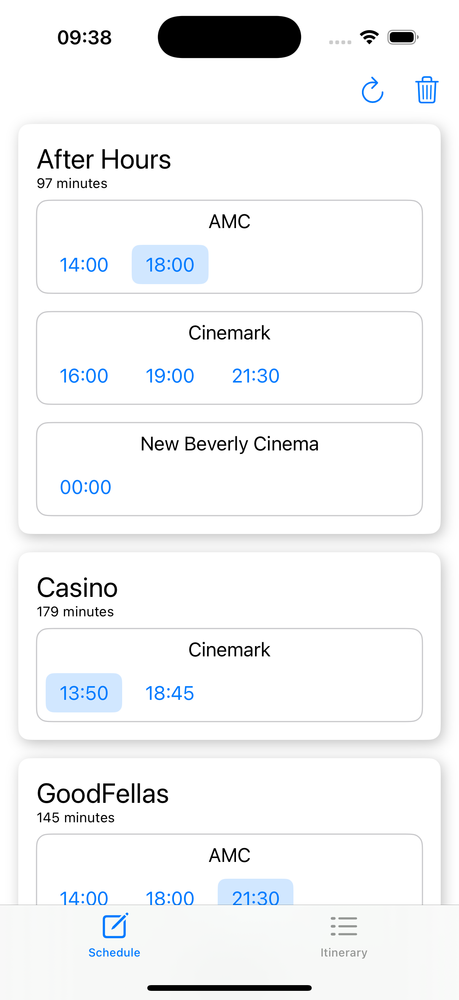
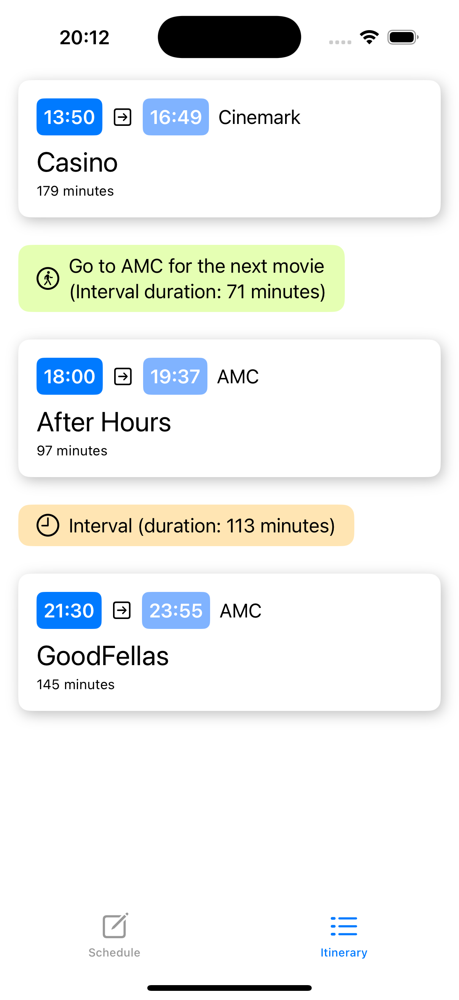

# Movie Schedule demo app for iOS

Movie Schedule is an iOS demo app that allows the user to pick a few movies to watch in the theaters and then generate an itinerary containing the schedules, available intervals between the pictures and possible conflicts.

This is just a demo, made as an example of a Swift app that uses **MVVM**, **DDD** and modern Swift async programming, as well other technologies like SwiftUI and CoreData.

Most of the data is fake (theaters and schedules are loaded from static JSON files). The movies, however, are retrieved from TMDB (themoviedb.org).

## Setup

In the root folder of the repository, there is a script called `Setup.sh` that downloads, installs and configures dependencies to build and run the project (except Xcode and iOS).

Most of it is optional, since the dependencies can be dowloaded and configured manually. **The first step, however, is mandatory, and not running it will cause the project to not build.** This is the step that will prompt for the TMDB API Key and generate the Secrets.swift file (more about that below).

```
sh Setup.sh
```

## Project structure

The Xcode project itself has only one .swift file, which contains the main function that configures the dependency injection and calls the entry point of the SwiftUI app (implemented in the UI module).

Everything else is spread in other local Swift packages modules, four of them representing the layers of DDD:

### DependenciesManager

- Module that implements a tiny dependency injection management library that is referenced by almost all other modules.

### Secrets

- Module with only one file containing constant values for API keys and secrets. This one file is auto-generated by Setup.sh and it is not under version control system.

### TMDBClient

- A client for the themoviedb.org, containing a small subset of their API. It's completelly isolated from the other modules. Since this app doesn't have its own backend server, this is basically the network module. It is used only by the infrastructure layer (see *MoviesScheduleInfrastructure*).

### MoviesScheduleDomain

- Module of the domain layer, containing entities, value objects, aggregates, *protocols* for the repositories and the *implementation* of services (stateless objects that execute some specific operations).

### MoviesScheduleInfrastructure

- Module of the infrastructure layer, containing the *implementation* of the repositories, utility classes to handle JSON files reading and database management (implemented with CoreData). Since many data of this app is fake, the entities are retrieved from JSON files referenced as resources in this package. The saved data (containing the user's selection), however, is truly saved in the local database and the movies are retrieved using the TMDBClient.

### MoviesScheduleApplication

- A small module for the application layer that only contains the view models (protocols and implementation) for the two views of the app.

### MoviesScheduleUI

- Contains the views and everything related to SwiftUI, including the entry point of the SwiftUI application.

## Technologies

### Concurrency

- This project uses the async-await features of Swift 5.5 instead of being closure-based. Almost everything runs in the main thread and is marked with @MainActor. Entities, value objects and others comply with Sendable, making it safe the exchange data between isolated pieces and avoids any kind of data races.

- When accessing files or the database, a task runs in a background thread only at the last possible moment, returning to the main thread as soon as the job is completed.

- The app forces a fake delay using a function called *fakeDelay()* to better demonstrate the execution of parallel tasks.

### SwiftUI

- Many features SwiftUI provides are used in favor of the MVVM architecture, since it is possible to bind values declared in the view model directly into the views or automatically update these views when values change.

### CoreData

- The database is implemented in the architecture layer using CoreData and DTO classes are used to convert between objects saved in the database and the objects declared in the model layer.

## Limitations

- Since many new iOS features are only available in newer devices, this project targets iOS 15. For example, this is why CoreData is being used instead of SwiftData.
- Because of limitations of observed values in SwiftUI of iOS 15, the actual implementation of the view models have to be declared public and directly accessed in the UI layer instead of using an indirect reference retrieved from the dependency management. This could be avoided in iOS 17.
- Like said above, this is a very simple demo with limited features and fake input data retrieved from static JSON files.

## Screenshots



